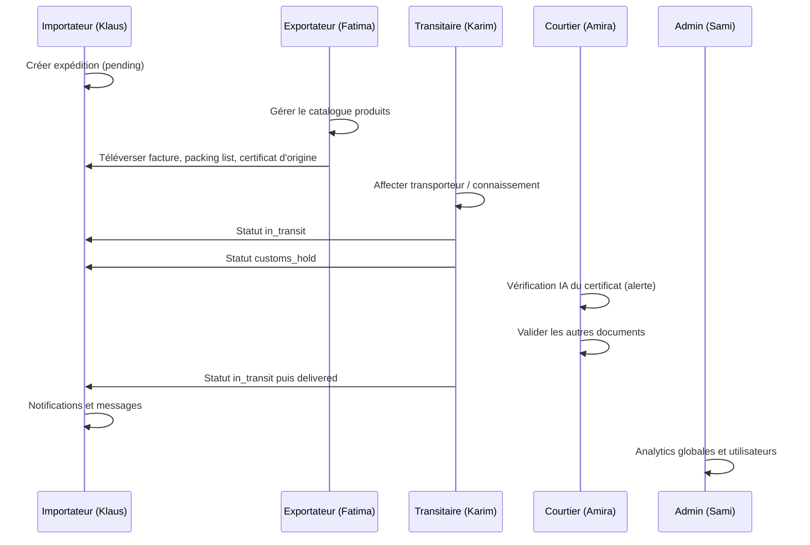

# GlobalTradeX — Scénario de présentation (projet de fin d’études)

Démonstration de bout en bout : **TunisOlive SARL (Tunisie) → FreshMart GmbH (Allemagne)** — huile d’olive par voie maritime, opérations transitaire, dédouanement et collaboration sur la plateforme.

**Durée conseillée :** 18–25 minutes (live) + 2 minutes de secours pour questions.

---

## 0. Avant la soutenance (préparation unique)

| Étape | Commande / action |
|-------|-------------------|
| Base de données | `cd backend` → `python -m alembic upgrade head` |
| Données de démo | `python seed_db.py` (comptes démo + scénario, expédition **GTX-20240315-00042**, produits, documents, messages) |
| Backend | `uvicorn main:app --reload` (port 8000) |
| Frontend | `cd frontend` → `npm run dev` (port 3000) |
| Env | Fichier `.env` backend : `DATABASE_URL`, `SECRET_KEY`, MailerSend `SMTP_*`, `FRONTEND_URL=http://localhost:3000` |
| Navigateurs | **5 profils distincts** ou fenêtres privées (un par rôle) pour éviter les conflits de session |

**Optionnel :** Regénérer le PDF checklist : `python generate_scenario_pdf.py` → `Scenario_Complet_GlobalTradeX_FR.pdf`.

---

## 1. Histoire métier (à dire en introduction)

> FreshMart GmbH à Hambourg commande **5 000 kg d’huile d’olive extra vierge** auprès de TunisOlive SARL à Sfax. MedTrans (transitaire) réserve le fret maritime sur le navire **Tunis Star**. À Hambourg, la douane signale un problème sur le **certificat d’origine** (tampon de la Chambre de commerce manquant). La courtière Amira Ben Brahim utilise la vérification documentaire assistée par IA avant la mainlevée.

**Référence expédition phare :** `GTX-20240315-00042`  
**Itinéraire :** Sfax, Tunisie → Hambourg, Allemagne  
**Statut au seed :** `customs_hold` (idéal pour enchaîner importateur + courtier)

---

## 2. Tableau des comptes

### A) Distribution des rôles (scénario recommandé pour le récit principal)

| Rôle | Nom | E-mail | Mot de passe | Tableau de bord |
|------|-----|--------|--------------|-----------------|
| Importateur | Klaus Weber (FreshMart) | `klaus.weber@scenario.globaltradex.com` | `Test123!` | `/dashboard/importateur` |
| Exportateur | Fatima Ben Ali (TunisOlive) | `fatima.benali@scenario.globaltradex.com` | `Test123!` | `/dashboard/exportateur` |
| Transitaire | Karim Mansour (MedTrans) | `karim.mansour@scenario.globaltradex.com` | `Test123!` | `/dashboard/transitaire` |
| Courtier en douane | Amira Ben Brahim | `amira.benbrahim@scenario.globaltradex.com` | `Test123!` | `/dashboard/courtier` |
| Administrateur | Sami Trabelsi | `admin@scenario.globaltradex.com` | `Admin123!` | `/dashboard/admin` |

Seuls ces cinq comptes sont conservés en base après `python seed_db.py` (les anciens comptes `@globaltradex.com` et `sami.trabelsi@…` sont supprimés).

---

## 3. Déroulé de la présentation (ordre recommandé)

### Acte 1 — Vue plateforme (Admin) · ~3 min

**Connexion :** `admin@scenario.globaltradex.com` / `Admin123!`

1. Ouvrir **Vue d’ensemble** (`/dashboard/admin`) — KPIs globaux, carte réseau, analytics.
2. Insister sur **l’accès par rôle** : l’admin peut ouvrir chaque cockpit depuis la barre latérale.
3. Ouvrir **Analytique** — expéditions en mouvement, file douane, documents en attente.
4. Optionnel : **Utilisateurs** (`/dashboard/admin/users`) — création de comptes (pré-vérifiés par l’admin).

**Phrase clé :** Une seule plateforme pour les opérations ; chaque acteur ne voit que son périmètre.

---

### Acte 2 — Importateur : besoin et visibilité · ~4 min

**Connexion :** `klaus.weber@scenario.globaltradex.com` / `Test123!`

1. **Cockpit import** (`/dashboard/importateur`) — KPIs commandes actives, douane, exceptions.
2. **Expéditions** → ouvrir **`GTX-20240315-00042`** :
   - Itinéraire, poids (5 000 kg), valeur (~42 500 USD), navire **Tunis Star**, statut **customs_hold**.
   - Lire les notes : certification bio + problème de tampon sur le certificat d’origine.
3. **Notifications** — alerte de blocage douanier sur cette expédition.
4. **Messages** — fil avec TunisOlive / transitaire (créé par le seed).
5. Action live optionnelle : **Nouvelle expédition** (`/dashboard/shipments/new`) :

   | Champ | Exemple |
   |-------|---------|
   | Origine | `Sfax, Tunisie` |
   | Destination | `Hambourg, Allemagne` |
   | Départ | Aujourd’hui + 7 jours |
   | Mode | Maritime · Fret général |
   | Poids | `5000` kg |
   | Volume | `6,5` m³ |
   | Valeur | `42500` USD |
   | Étape 3 | Ignorer le catalogue (importateur) |
   | Valider | Statut `pending` → référence `GTX-AAAAMMJJ-#####` |

**Phrase clé :** L’importateur porte la commande ; il voit le blocage et les lacunes documentaires avant le dédouanement.

---

### Acte 3 — Exportateur : catalogue et documents commerciaux · ~4 min

**Connexion :** `fatima.benali@scenario.globaltradex.com` / `Test123!`

1. **Produits** (`/dashboard/products`) — **Huile d’olive extra vierge**, code SH **1509.10**, origine Tunisie.
2. CRUD live (30 s) : ajouter **Huile d’olive bio 1 L**, SH `1509.90`, prix `12,00`, qté `1000`, unité `unités`, origine `Tunisie`.
3. **Cockpit exportateur** — KPIs revenus / expéditions.
4. **Documents** (`/dashboard/documents`) — filtrer **GTX-20240315-00042** :
   - Facture commerciale ✓ vérifiée  
   - Liste de colisage ✓ vérifiée  
   - Certificat d’origine ✗ **signalé par l’IA** (tampon chambre manquant)  
5. Optionnel : **Nouvelle expédition** en tant qu’exportateur — lier des lignes catalogue à l’étape 3.

**Phrase clé :** L’exportateur maîtrise le référentiel produit et les pièces d’origine ; l’IA pré-détecte le risque conformité.

---

### Acte 4 — Transitaire : logistique et statuts · ~4 min

**Connexion :** `karim.mansour@scenario.globaltradex.com` / `Test123!`

1. **Cockpit fret** (`/dashboard/transitaire`) — KPIs en transit / retard / livré aujourd’hui.
2. Onglet **Expéditions actives** → **`GTX-20240315-00042`** (ou votre nouvelle référence `GTX-…`).
3. **Mettre à jour le statut** (transitions valides) :

   ```
   customs_hold  →  in_transit   (mainlevée — poursuite du voyage)
   in_transit      →  delivered    (livraison finale)
   ```

   Ou montrer un incident : `in_transit` → `delayed` → `in_transit`.

4. Lors de la mise à jour, renseigner :
   - Notes : `Mainlevée douane Hambourg — acheminement entrepôt FreshMart`
   - Navire : `Tunis Star`
   - Voyage : `HLU-TN-2024-0318`
   - ETA : +3 jours
5. **Téléverser un document** → connaissement (PDF).

**Phrase clé :** Seul le transitaire fait avancer le statut opérationnel ; les transitions invalides sont refusées par l’API.

---

### Acte 5 — Courtier en douane : IA et mainlevée · ~4 min

**Connexion :** `amira.benbrahim@scenario.globaltradex.com` / `Test123!`

1. **Cockpit douane** (`/dashboard/courtier`) — déclarations en attente, alertes.
2. **Documents** → en attente de revue → ouvrir **Certificate_of_Origin_Made_in_Tunisia.pdf** sur GTX-42.
3. **Lancer la vérification IA** — résultat : tampon Chambre de commerce manquant.
4. **Valider** facture / liste de colisage.
5. **Rejeter** ou laisser le certificat d’origine en attente (selon l’interface).
6. Vérifier la liste **Expéditions** — cohérence avec le récit `customs_hold`.

**Phrase clé :** Dédouanement avec humain dans la boucle ; l’IA réduit le temps de lecture manuelle.

---

### Acte 6 — Collaboration et compte · ~2 min

Avec n’importe quel utilisateur connecté :

1. **Messages** — répondre dans un fil existant ou **Nouveau message** vers un autre compte scénario.
2. **Paramètres** — basculer les préférences de notification → Enregistrer → actualiser (persistance).
3. **Paramètres** → **Se déconnecter**.

---

### Acte 7 — Parcours « nouvel utilisateur » (optionnel, si MailerSend fonctionne) · ~3 min

Utiliser une **vraie boîte mail** que vous contrôlez.

1. `/register` — créer un compte (rôle importateur par défaut).
2. Consulter l’e-mail → `/verify-email?token=…` → valider.
3. `/login` → tableau de bord.
4. `/forgot-password` → lien de réinitialisation → `/reset-password` → nouveau mot de passe.

**Plan B si SMTP tombe en panne :** Expliquer que la vérification est branchée sur MailerSend et utiliser les comptes scénario pour la démo live.

---

## 4. Diagramme du cycle de vie (pour slides)



---

## 5. Machine à états des statuts (à expliquer chez le transitaire)

| Statut actuel | Statuts suivants autorisés |
|---------------|----------------------------|
| `pending` | `in_transit` |
| `in_transit` | `customs_hold`, `delivered`, `delayed` |
| `customs_hold` | `in_transit`, `delivered` |
| `delayed` | `in_transit`, `cancelled` |
| `delivered` / `cancelled` | *(aucun)* |

---

## 6. Fonctionnalités → URLs

| Fonctionnalité | URL |
|----------------|-----|
| Connexion | `/login` |
| Inscription | `/register` |
| Nouvelle expédition | `/dashboard/shipments/new` |
| Toutes les expéditions | `/dashboard/shipments` |
| Carte live | `/dashboard/shipments/tracking` |
| Documents | `/dashboard/documents` |
| Produits | `/dashboard/products` |
| Messages | `/dashboard/messages` |
| Notifications | `/dashboard/notifications` |
| Assistant IA | `/dashboard/assistant` |
| Paramètres / déconnexion | `/dashboard/settings` |
| Vue admin | `/dashboard/admin` |

---

## 7. Dépannage pendant la démo

| Problème | Solution |
|----------|----------|
| Connexion 403 « e-mail non vérifié » | Comptes scénario/démo, ou compléter `/verify-email` |
| Expédition GTX vide | Relancer `python seed_db.py` |
| Pas de messages | Le seed crée des fils ; en envoyer un en live |
| Échec vérification IA | Définir `GOOGLE_API_KEY` dans `.env` backend |
| 401 sur le dashboard | Effacer les cookies ; se reconnecter |
| Mauvais cockpit de rôle | Le middleware redirige vers le rôle de l’utilisateur |

---

## 8. Script d’une page (à lire si le trac se coupe)

1. **« GlobalTradeX relie importateurs, exportateurs, transitaires et courtiers sur un même dossier d’expédition. »**
2. **Admin** — KPIs réseau et preuve qu’une expédition traverse toute la chaîne.
3. **Klaus (importateur)** — ouvrir GTX-42 en `customs_hold` ; notifications.
4. **Fatima (exportateur)** — catalogue + documents ; alerte IA sur le certificat d’origine.
5. **Karim (transitaire)** — mise à jour légale du statut + connaissement.
6. **Amira (courtier)** — vérification IA + validation / rejet des pièces.
7. **Collaboration** — message + paramètres + déconnexion.
8. **Conclusion** — « De l’inscription vérifiée par e-mail jusqu’à la mainlevée douanière, la plateforme couvre le flux commerce international complet. »

---

## 9. Après la soutenance

- [ ] Captures : vue admin + résultat IA douane pour l’annexe du rapport  
- [ ] Exporter `Scenario_Complet_GlobalTradeX_FR.pdf` si le jury préfère ce format  
- [ ] Noter les références créées en live (`GTX-…`) dans le mémoire  

Bonne soutenance.
