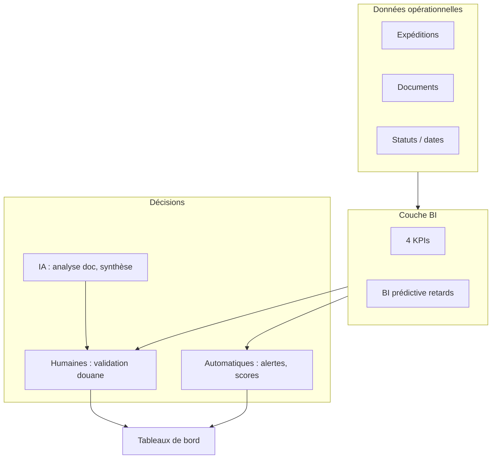

# §1.6.3 — Stratégie Business Intelligence (Chapitre 1)

> **Section clé PFE** — À insérer dans le Chapitre 1, après les besoins fonctionnels généraux (§1.6.1) et avant ou après les besoins non fonctionnels (§1.6.2).

---

## 1. Objectif de la couche BI

GlobalTradeX ne se contente pas de stocker des dossiers. La plateforme **aide à décider** :

- Où sont les retards ?
- Quels documents bloquent la douane ?
- Quel transitaire ou corridor présente le plus de risque ?
- L'estimation de coût était-elle fiable ?

La **Business Intelligence** transforme les données opérationnelles en **indicateurs** et **alertes** pour répondre à ces questions sans analyse manuelle sur Excel.

---

## 2. Les quatre KPIs métiers retenus

| # | KPI | Question métier | Décision associée |
|---|-----|-----------------|-------------------|
| **1** | **Taux de retard à l'arrivée** | Quelle part des expéditions arrive en retard par rapport à la date prévue ? | Prioriser le suivi des dossiers à risque ; choisir un transitaire ou un corridor |
| **2** | **Temps moyen de dédouanement** | Combien de temps les dossiers restent-ils bloqués en douane ? | Dimensionner l'équipe courtier ; alerter l'importateur |
| **3** | **Taux de conformité documentaire** | Quelle part des pièces est validée du premier coup ? | Corriger les documents avant expédition ; former les exportateurs |
| **4** | **Coût estimé vs coût réel** | L'estimation initiale correspond-elle au coût final ? | Ajuster le calculateur ; négocier avec le transitaire |

Détail des formules et sources : [03_KPI_METIERS_CATALOGUE.md](./03_KPI_METIERS_CATALOGUE.md).

---

## 3. Quelles décisions automatiser ?

GlobalTradeX distingue **trois niveaux** de décision :

### Niveau 1 — Automatisation complète (sans intervention humaine)

| Décision | Déclencheur | Action automatique |
|----------|-------------|-------------------|
| Alerte changement de statut | Transitaire met à jour le statut | Notification à l'importateur et à l'exportateur |
| Alerte blocage douanier | Passage en statut « blocage douanier » | Notification prioritaire aux parties du dossier |
| Calcul des KPIs | Consultation d'un cockpit | Agrégation et affichage des 4 indicateurs |
| Score de risque de retard | Expédition active avec historique disponible | Calcul de la probabilité de retard (BI prédictive) |
| Refus de transition invalide | Statut logistique incohérent | Blocage de la mise à jour et message d'erreur |

### Niveau 2 — Aide à la décision (humain valide)

| Décision | Aide apportée | Décideur final |
|----------|---------------|----------------|
| Conformité d'un document | Analyse automatique : anomalies, champs manquants | **Courtier** approuve ou rejette |
| Priorisation de la file douane | Classement par date, alertes IA, KPI conformité | **Courtier** choisit l'ordre de traitement |
| Choix d'itinéraire | Suggestions de routes avec estimation de coût et risque | **Importateur / exportateur** |
| Réaction à un retard probable | Synthèse exécutive + score sur le dashboard | **Transitaire / admin** ajuste ETA ou ressources |

### Niveau 3 — Advanced Analytics (complément IA)

| Capacité | Rôle |
|----------|------|
| Assistant TradeFlow | Répondre aux questions, expliquer un KPI, guider l'utilisateur |
| Synthèse BI prédictive | Résumer en langage naturel les scores de retard |
| Analyse documentaire IA | Pré-analyser une pièce avant la revue humaine |

> **Principe** : la BI **mesure et alerte** ; l'IA **explique et assiste** ; l'humain **valide** les décisions réglementaires (douane).

---

## 4. Répartition des KPIs par acteur

| Acteur | KPIs visibles | BI prédictive |
|--------|---------------|---------------|
| **Administrateur** | Les 4 KPIs réseau | Oui — vue globale |
| **Transitaire** | Retards, dédouanement, conformité, coûts (périmètre fret) | Oui — performance transitaire |
| **Courtier** | Conformité, dédouanement, file de revue | Non (focus conformité) |
| **Importateur** | Retards, dédouanement, conformité, coûts (ses dossiers) | Non |
| **Exportateur** | Retards sortants, conformité de ses documents, coûts | Non |

---

## 5. Lien avec le Chapitre 2 (architecture Data)

Les KPIs et la BI prédictive s'appuient sur une architecture **OLTP / OLAP** :

| Couche | Rôle | Exemple |
|--------|------|---------|
| **OLTP** | Données opérationnelles en temps réel | Création expédition, téléversement document, changement de statut |
| **OLAP** | Calcul des indicateurs et scores | Taux de retard, BI prédictive, agrégats analytics |
| **ELT** | Extraction → transformation → restitution | Données lues en base, agrégées par les services analytiques, affichées sur les dashboards |

Détail complet : [../chapitre-02-preparation/02_ARCHITECTURE_DES_DONNEES.md](../chapitre-02-preparation/02_ARCHITECTURE_DES_DONNEES.md).

**Exemple de flux** : un document téléversé (OLTP) → analyse IA → validation courtier → agrégation → **taux de conformité** affiché sur le cockpit (OLAP).

---

## 6. Paragraphe rapport (copier-coller §1.6.3)

> La stratégie **Business Intelligence** de GlobalTradeX repose sur **quatre KPIs métiers** : taux de retard à l'arrivée, temps moyen de dédouanement, taux de conformité documentaire et écart entre coût estimé et coût réel. Ces indicateurs alimentent les cockpits de chaque acteur et permettent de **piloter** le réseau logistique sans reconstituer manuellement les données.
>
> La plateforme **automatise** les alertes (statuts, blocages douaniers), le **calcul des KPIs** et la **prédiction des retards** à partir de l'historique des transitaires et des corridors. Les décisions réglementaires (validation ou rejet d'un document) restent **humaines**, assistées par l'analyse automatique des pièces et par la BI prédictive. L'assistant TradeFlow constitue la couche **Advanced Analytics** en complément.
>
> L'architecture des données (séparation **OLTP / OLAP**, pipeline **ELT**) est détaillée au Chapitre 2.

---

## 7. Schéma synthèse (figure rapport)

