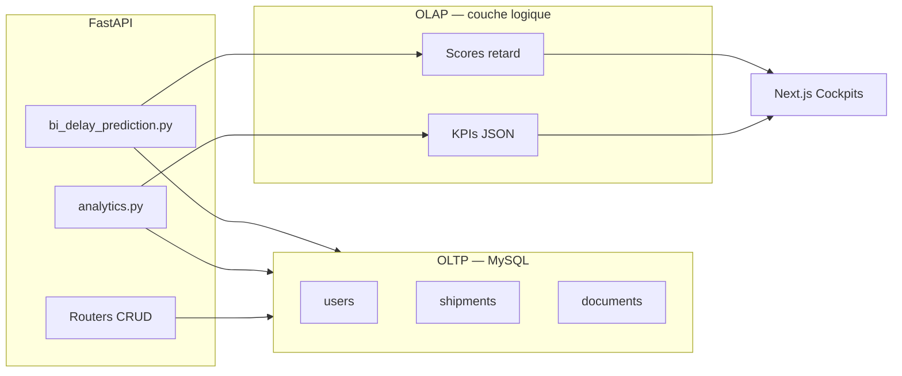

# §2.4 Architecture des données (OLTP / OLAP)

> **Étape 2 PFE (Chapitre 2)** — Expliquer où sont stockées les données analytiques, la séparation **OLTP / OLAP**, et le pipeline **ELT** (retour encadrement).
>
> **Lien Chapitre 1** : les 4 KPIs et la stratégie BI sont définis en [§1.6.3](../chapitre-01-analyse/09_STRATEGIE_BI_CHAPITRE_1.md).

---

## Résumé en 4 phrases (copier-coller en tête de §2.4)

1. Les **données opérationnelles** (expéditions, documents, statuts) sont stockées en **OLTP** dans MySQL.
2. Les **indicateurs et la BI prédictive** sont calculés en **OLAP** par des services analytiques dédiés.
3. GlobalTradeX utilise un pipeline **ELT à la demande** : extraction SQL, transformation en mémoire, restitution sur les dashboards.
4. Un **entrepôt logique** (pas de second serveur en PFE) et des **Data Marts par rôle** filtrent les KPIs selon l'acteur connecté.

---

## 2.4.1 Problématique

GlobalTradeX manipule deux types de charges distinctes :

1. **Transactionnelle (OLTP)** — création d'expéditions, upload de documents, changements de statut, messagerie : nombreuses écritures, faible latence, intégrité référentielle stricte.
2. **Analytique (OLAP)** — KPIs réseau, tendances mensuelles, performance transitaire, **BI prédictive** des retards : lectures agrégées, scans historiques, calculs statistiques.

Mélanger ces deux logiques dans les mêmes endpoints CRUD dégraderait la maintenabilité et le performance tuning. Le projet adopte donc une **séparation logique OLTP / OLAP**, même si, en phase PFE, les deux s'appuient sur la **même instance MySQL** (choix pragmatique pour XAMPP / soutenance).

> *Remarque : les principes décrits ci-dessous s'appliquent identiquement si l'on remplace MySQL par **PostgreSQL** : une base transactionnelle source et une couche analytique séparée (services ou entrepôt dédié).*

---

## 2.4.2 Vue d'ensemble

```
┌─────────────────────────────────────────────────────────────────────────┐
│                        COUCHE PRÉSENTATION (Next.js)                       │
│   Cockpits KPI │ TradeAnalyticsPage │ PredictiveBiPanel │ Cartes GPS    │
└───────────────────────────────────┬─────────────────────────────────────┘
                                    │ HTTP /api/analytics/*
                                    │ HTTP /api/shipments, /documents… (OLTP)
┌───────────────────────────────────▼─────────────────────────────────────┐
│                     COUCHE APPLICATION (FastAPI)                         │
│  ┌─────────────────────────────┐  ┌──────────────────────────────────┐  │
│  │   ROUTERS OLTP (CRUD)       │  │   ROUTERS / SERVICES OLAP        │  │
│  │   auth, shipments, docs,    │  │   analytics.py                   │  │
│  │   messages, notifications   │  │   bi_delay_prediction.py         │  │
│  │   → écritures + lectures    │  │   → lectures agrégées uniquement │  │
│  │     unitaires               │  │   → ELT à la demande             │  │
│  └──────────────┬──────────────┘  └──────────────────┬───────────────┘  │
└─────────────────┼─────────────────────────────────────┼─────────────────┘
                  │ SQLAlchemy (sessions OLTP)            │ SQLAlchemy (lectures)
┌─────────────────▼─────────────────────────────────────▼─────────────────┐
│              STOCKAGE PHYSIQUE — MySQL `globaltradex`                    │
│  ┌─────────────────────────────────────────────────────────────────────┐ │
│  │  SCHÉMA OLTP (normalisé 3FN)                                        │ │
│  │  users │ shipments │ documents │ products │ notifications │ …       │ │
│  │  + colonnes analytiques sources : forwarder_user_id, dates, statuts │ │
│  └─────────────────────────────────────────────────────────────────────┘ │
│  Fichiers binaires : uploads/ (PDF, images — hors entrepôt relationnel)   │
└─────────────────────────────────────────────────────────────────────────┘
```

---

## 2.4.3 Couche OLTP (Online Transaction Processing)

### Rôle

Enregistrer et maintenir l'**état opérationnel** du réseau GlobalTradeX en temps quasi réel.

### Stockage

- **SGBD** : MySQL 8 (XAMPP en développement / soutenance).
- **Alternative dev** : SQLite (`globaltradex.db`) pour clones sans serveur MySQL.
- **ORM** : SQLAlchemy 2.x — modèles dans `backend/models/`.
- **Migrations** : Alembic (`backend/migrations/versions/`).

### Tables transactionnelles principales

| Domaine | Tables | Opérations typiques |
|---------|--------|---------------------|
| Identité | `users` | Inscription, JWT, rôles |
| Logistique | `shipments`, `shipment_products` | CRUD expédition, transitions statut |
| Documentaire | `documents` | Upload, validation, `ai_result` JSON |
| Catalogue | `products` | CRUD exportateur |
| Collaboration | `messages`, `notifications` | Échanges, alertes |
| Assistant | `assistant_sessions`, … | Sessions TradeFlow |

### Principes OLTP respectés

- **ACID** sur chaque transaction métier (ex. validation document + notification).
- **Pas d'agrégation lourde** dans les routers CRUD (`shipments.py`, `documents.py`).
- Index sur clés étrangères (`owner_id`, `shipment_id`, `forwarder_user_id`).

---

## 2.4.4 Couche OLAP (Online Analytical Processing)

### Rôle

Transformer les données OLTP en **indicateurs**, **tendances** et **scores prédictifs** pour les cockpits Data-Driven (Chapitre 1).

### Où sont « stockées » les données analytiques ?

En **version PFE**, les résultats analytiques ne sont **pas persistés** dans un entrepôt séparé : ils sont **calculés à la volée** (ELT on-demand) et renvoyés en JSON au frontend. Les **données sources** restent en OLTP ; la **connaissance** (KPIs, scores) est **matérialisée dans la réponse API** et affichée dans l'UI.

| Type de donnée analytique | Production | Consommation |
|---------------------------|------------|--------------|
| Agrégats réseau (volumes, statuts) | `GET /api/analytics/global` | Admin analytics |
| KPIs utilisateur | `GET /api/analytics/summary` | Cockpits par rôle |
| Conformité documents | `GET /api/analytics/documents` | Courtier / admin |
| BI prédictive retards | `GET /api/analytics/predictive-bi` | Admin, transitaire |
| Synthèse exécutive IA | Champ `ai_insights` (Gemini) | PredictiveBiPanel |

### Data Warehouse (entrepôt de données)

**Statut projet : entrepôt logique, pas entrepôt physique dédié.**

- **Entrepôt logique** : l'ensemble des tables OLTP historisées (`shipments` livrées, `GTX-HIST-*` seedées) constitue la **single source of truth** pour l'analytique.
- **Schéma en étoile conceptuel** (modèle dimensionnel *virtuel*) :
  - **Fait** : `shipments` (mesures : délais, coûts, retards, statuts).
  - **Dimensions** : `users` (transitaire, importateur), corridor (origine/destination/mode), `documents` (conformité), temps (`created_at`, `departure_date`, `arrival_date`).

**Évolution production** (à mentionner en perspective) :

- Création d'un **schéma DW** (`dw_*`) ou base MySQL/PostgreSQL analytique.
- **Vues matérialisées** pour KPIs lourds (retard mensuel, performance transitaire).
- Réplication **read replica** MySQL pour isoler les lectures OLAP.

---

## 2.4.5 Data Marts (entrepôts départementaux)

Un **Data Mart** est un sous-ensemble orienté métier. GlobalTradeX implémente des **Data Marts logiques** par rôle via filtrage applicatif :

| Data Mart | Rôle | Périmètre données | Endpoint |
|-----------|------|-------------------|----------|
| Mart réseau | Administrateur | Toutes expéditions, tous documents | `/analytics/global`, `/predictive-bi` |
| Mart fret | Transitaire | Expéditions réseau + performance forwarder | Cockpit transitaire, `/predictive-bi` |
| Mart import | Importateur | `owner_id = moi` | `/analytics/summary`, cockpit import |
| Mart export | Exportateur | Expéditions où je suis exportateur | `/analytics/shipments` |
| Mart douane | Courtier | Documents + expéditions `customs_hold` | Cockpit courtier, file revue |

Implémentation : fonction `_shipments_for_bi()` dans `analytics.py` applique le filtre rôle avant passage au `DelayPredictionEngine`.

---

## 2.4.6 Pipeline ETL / ELT

GlobalTradeX utilise un pattern **ELT** (*Extract — Load — Transform*) **à la demande**, déclenché par chaque requête analytics :

```
  ┌──────────┐    ┌──────────────┐    ┌─────────────────┐    ┌────────────┐
  │ EXTRACT  │───▶│ LOAD         │───▶│ TRANSFORM       │───▶│ LOAD       │
  │ SQL      │    │ Objets       │    │ Agrégations,    │    │ JSON API   │
  │ MySQL    │    │ Python /     │    │ scoring BI,     │    │ → React    │
  │ (OLTP)   │    │ SQLAlchemy   │    │ KPIs, Gemini    │    │ charts     │
  └──────────┘    └──────────────┘    └─────────────────┘    └────────────┘
```

### Étapes détaillées (exemple BI prédictive)

1. **Extract** — `SELECT` shipments avec `joinedload` (documents, forwarder, owner).
2. **Load** — Hydratation liste Python + `_HistoryRow` dans `DelayPredictionEngine`.
3. **Transform** — Calcul taux retard par corridor, performance transitaire (lissage bayésien), score risque par expédition active, tendance mensuelle.
4. **Load (présentation)** — JSON `report` + optionnel `ai_insights` (synthèse Gemini).

### Différence ETL vs ELT ici

| Approche | GlobalTradeX PFE |
|----------|------------------|
| **ETL** classique | Extract → Transform (job batch) → Load entrepôt → requêtes BI |
| **ELT** retenu | Extract → Load mémoire → Transform services → réponse API immédiate |

**Justification PFE** : volume modéré (jeu seed ~ dizaines / centaines de lignes), pas de cluster ; simplicité de déploiement XAMPP. Le script `reset_and_seed_db.py` joue le rôle de **jeu d'essai analytique** (expéditions `GTX-HIST-*`, transitaire Karim Mansour).

### Évolution ETL batch (perspective)

- Job nocturne Celery/cron : alimenter tables `fact_shipments`, `dim_forwarder`.
- Outil type **dbt** ou scripts SQL sur PostgreSQL/MySQL replica.

---

## 2.4.7 Mapping KPIs métier ↔ sources OLTP

| KPI (Chapitre 1) | Champs / tables OLTP source | Couche OLAP |
|------------------|----------------------------|-------------|
| Taux de retard à l'arrivée | `shipments.status`, `estimated_arrival`, `arrival_date` | `bi_delay_prediction`, `/analytics/global` |
| Temps moyen de dédouanement | Transitions `customs_hold`, `verified_at` documents | Agrégats analytics + cockpit courtier |
| Taux conformité documents | `documents.is_verified`, `ai_result`, `rejection_reason` | `/analytics/documents` |
| Coût estimé vs réel | Calculateur, `estimated_*` / freight sur shipment | Cockpits + analytics (écart %) |

---

## 2.4.8 Séparation des responsabilités (règles d'architecture)

| Règle | Application |
|-------|-------------|
| Les routers OLTP ne calculent pas de KPIs réseau | `shipments.py` : statut uniquement |
| Les endpoints OLAP sont en lecture seule | `analytics.py` : pas de `INSERT`/`UPDATE` |
| L'IA documentaire écrit dans OLTP | `ai_result` JSON sur `documents` |
| La BI prédictive lit, ne modifie pas | `DelayPredictionEngine.build_report()` |
| Historique BI alimenté par seed / opérations réelles | `reset_and_seed_db.py` |

---

## 2.4.9 Diagramme de flux données (simplifié)



---

## 2.4.10 Paragraphe de synthèse (copier-coller rapport)

> L'architecture des données de GlobalTradeX distingue clairement le **transactionnel (OLTP)** et l'**analytique (OLAP)**. Les opérations métier (expéditions, documents, messagerie) s'appuient sur un schéma relationnel **MySQL** normalisé, géré par SQLAlchemy et Alembic. Les indicateurs de performance, les analytics globales et la **BI prédictive** des retards sont produits par une **couche OLAP applicative** (services FastAPI) suivant un pipeline **ELT à la demande** : extraction SQL, transformation en mémoire (agrégations, scoring explicable, synthèse Gemini), restitution JSON vers les cockpits. Des **Data Marts logiques** par rôle filtrent le périmètre analytique. Un **Data Warehouse** physique (vues matérialisées ou base répliquée) constitue la piste d'évolution pour un déploiement à grande échelle, sans remettre en cause la séparation conceptuelle OLTP/OLAP mise en œuvre dans le PFE.

---

## Références code

| Élément | Fichier |
|---------|---------|
| Endpoints analytics | `backend/routers/analytics.py` |
| Moteur BI | `backend/services/bi_delay_prediction.py` |
| Modèle expédition | `backend/models/shipment.py` |
| Seed historique BI | `backend/reset_and_seed_db.py` |
| UI BI | `frontend/components/analytics/PredictiveBiPanel.jsx` |

Voir aussi : [00_OBSERVATIONS_SUPERVISEUR.md](./00_OBSERVATIONS_SUPERVISEUR.md), Chapitre 1 [03_KPI_METIERS_CATALOGUE.md](../chapitre-01-analyse/03_KPI_METIERS_CATALOGUE.md).
