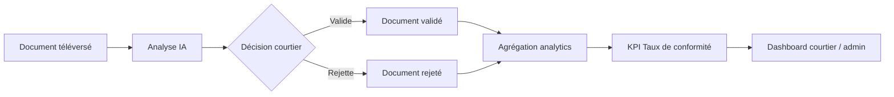

# Flux de données BI — Lien avec diagrammes (classes & séquences)

> **Recommandation superviseur n°3** : montrer comment une **donnée brute** devient un **indicateur** sur le dashboard.

---

## Exemple principal : Document téléversé → Taux de conformité

### Chaîne en 5 étapes (langage simple)

| Étape | Action | Résultat stocké |
|-------|--------|-----------------|
| 1 | L’exportateur **téléverse** un document (PDF) | Fichier + enregistrement `Document` en base |
| 2 | Le courtier lance l’**analyse IA** | Résultat : conforme / anomalies / champs manquants |
| 3 | Le courtier **valide** ou **rejette** | Document marqué validé ou rejeté avec motif |
| 4 | Le service **analytics** agrège | Compte : validés, rejetés, total sur une période |
| 5 | Le **dashboard** affiche | **Taux de conformité** = validés du premier coup / total |

**Formule KPI :**  
Taux de conformité (%) = (documents validés sans rejet) / (documents soumis) × 100

---

## Schéma flux (à mettre en figure rapport)



---

## Autres flux BI à mentionner dans les diagrammes

### Expédition → Taux de retard à l’arrivée

```
Création expédition (ETA) → Mises à jour statut (transitaire) → Arrivée réelle ou retard
→ analytics.py compare dates → KPI « taux de retard » → Cockpit importateur / admin
```

### Historique transitaire → BI prédictive

```
Expéditions passées + forwarder assigné → bi_delay_prediction.py calcule scores
→ probabilité de retard sur expéditions actives → PredictiveBiPanel
```

### Calculateur → Coût estimé vs réel

```
Estimation à la création → coûts saisis en fin de dossier → écart % sur dashboard
```

---

## Où modéliser dans les diagrammes UML

| Diagramme | Éléments BI à inclure |
|-----------|----------------------|
| **Classes** | `Document` (+ statut validation), `Shipment`, service `DelayPredictionEngine`, DTO agrégats analytics |
| **Séquence « Vérifier document IA »** | Exportateur → API → Gemini → Courtier → notification |
| **Séquence « Consulter analytics »** | Utilisateur → `/api/analytics` → SQL agrégations → JSON KPI → Chart.js |
| **Séquence « BI prédictive »** | Transitaire → `predictive-bi` → moteur scoring → synthèse Gemini → UI |

Fichiers PlantUML existants : `diagramme-classes-global/`, `docs/releases/.../diagramme-sequence/`

---

## Paragraphe rapport (§2.6 ou chapitre conception — copier-coller)

> Les diagrammes de classes et de séquences modélisent explicitement les **flux analytiques** : une donnée opérationnelle (document téléversé, changement de statut, date d’arrivée) est persistée en OLTP, puis **agrégée** par la couche analytics (ELT à la demande) pour produire les KPIs affichés sur les tableaux de bord. Le parcours « document → analyse IA → validation → taux de conformité » illustre la transformation **donnée brute → indicateur décisionnel**.

---

## Tableau synthèse (TABLE optionnelle)

| Donnée brute | Traitement | KPI dashboard |
|--------------|------------|---------------|
| Document + validation | Agrégation conformité | Taux conformité documents |
| ETA vs arrivée réelle | Calcul délais | Taux retard à l’arrivée |
| Entrée / sortie douane | Durée customs | Temps moyen dédouanement |
| Coût estimé vs saisi | Comparaison montants | Écart coût estimé / réel |
| Historique transitaire | Scoring BI | Probabilité retard (prédictif) |

Voir : [02_ARCHITECTURE_DES_DONNEES.md](./02_ARCHITECTURE_DES_DONNEES.md), [06_STACK_BI_ET_JUSTIFICATION.md](./06_STACK_BI_ET_JUSTIFICATION.md).
